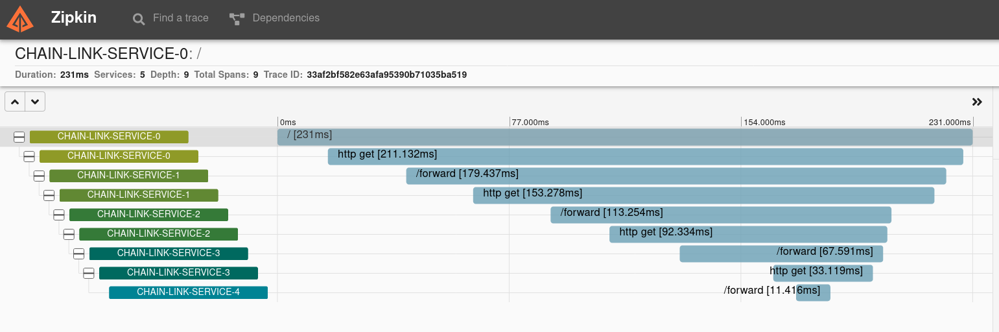
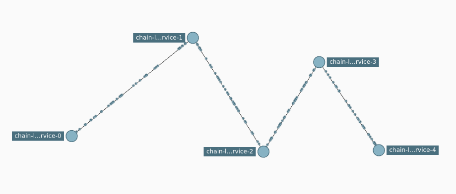

# chain-link

This is a not a crypto app. :) It's really meant as a demo app that can be deployed into Kubernetes and then used by some other tooling to visualize connectivity.

Using the app and CLI tool in this repository, several pods will be deployed to Kubernetes, and when the first one of those pods is connected to on port 80, it will connect to the next "chain-link" pod, which will forward it to the next pod, and so on, forming a "service chain". That chain can then be visualized in something like the Zipkin GUI.

```
+-------------------+        +--------------------+         +--------------------+        +--------------------+
|                   |        |                    |         |                    |        |                    |
|  loadgenerator    +-------->    chain-link-0    +--------->    chain-link-1    +-------->    chain-link-(n)  |
|                   |        |                    |         |                    |        |                    |
+-------------------+        +--------------------+         +--------------------+        +--------------------+
```

The application is configured to send traces to a Zipkin instance that is deployed into the same namespace.

There is a loadgenerator pod that will continuously poll the first deployment to create traffic.

## How to Deploy

1. Check out the git repository
1. OPTIONAL: Build the image and put it into a registry that the Kubernetes nodes can pull from. Otherwise the default image will be used.
2. Deploy with the CLI provided (which might require setting up a suitable Python environment)

### OPTIONAL: Build the Image

Build the image and push it into your registry.

```
docker build -t chain-link .
docker tag chain-link <your registry>/chain-link:latest
docker push <your registry>/chain-link:latest
```

### Deploy the Kubernetes Resources

Use the provided CLI to deploy into Kubernetes. There are a few options that can be set, so use `--help` to determine the options.

```
./chain-link-cli -h
```

The number of instances is configurable:

```
./chain-link-cli --instances 5 deploy
```

## What is Deployed

* A specified number of instances of the chain-link application
* loadgenerator instance
* Zipkin instance

Below is an example of a deployment with five chain link instances.

```
$ k get pods
NAME                                       READY   STATUS    RESTARTS   AGE
chain-link-deployment-0-785c6fc8c9-mfx8s   1/1     Running   0          20m
chain-link-deployment-1-74b5c7bc7f-4d5zr   1/1     Running   0          19m
chain-link-deployment-2-77cdf4f74c-lsmb2   1/1     Running   0          19m
loadgenerator                              1/1     Running   0          19m
zipkin-deployment-5c44dd85ff-5vdmw         1/1     Running   0          20m
```

## Zipkin

The application is configured to send traces to the Zipkin service.

### Access Zipkin

Port forward to it and access the service from your localhost in the browser on port 9411.

```
kubectl port-forward svc/zipkin-service 9411:80
```

### What it Looks Like in Zipkin






